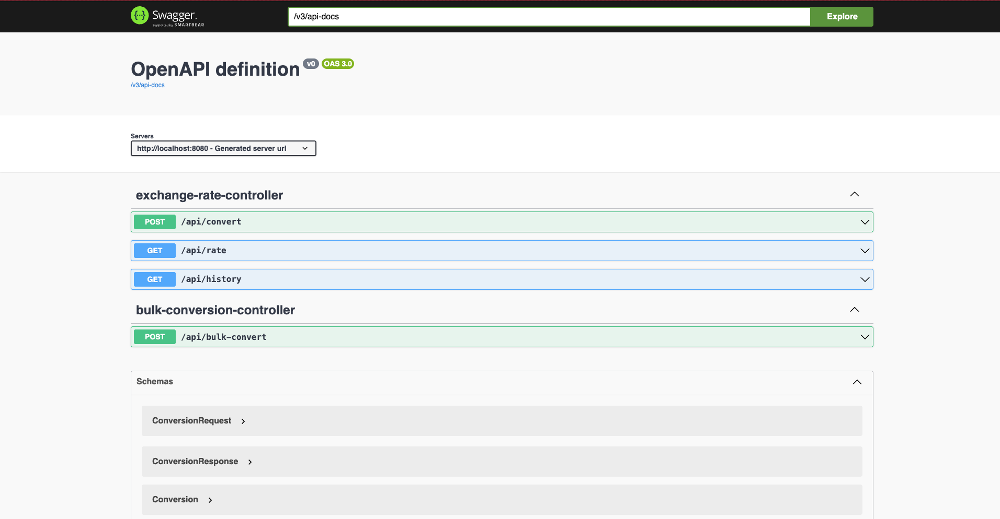
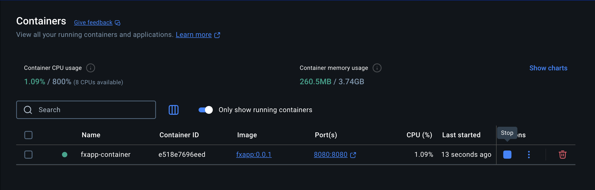
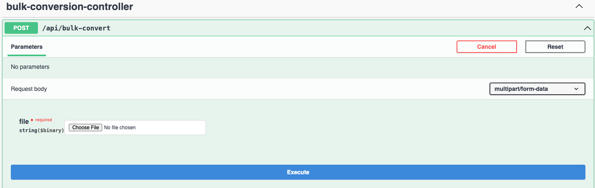
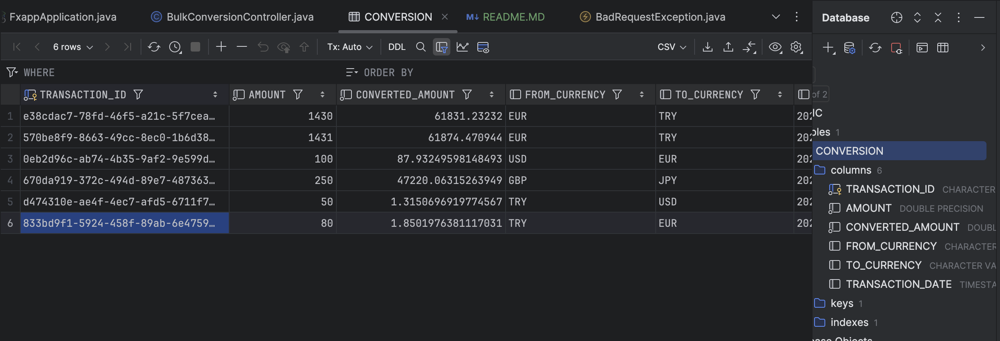
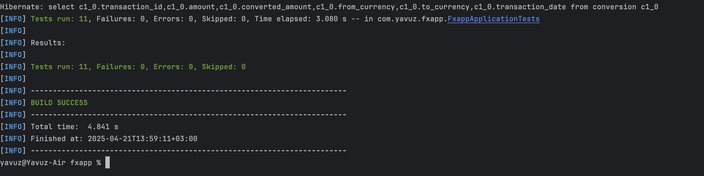

# FXApp – Foreign Exchange Application

FXApp is a lightweight and scalable Spring Boot-based RESTful web service that allows currency exchange, conversion history tracking, and batch conversions using external exchange rate providers. It is designed as part of a Java Developer recruitment task.

## Features

- **Exchange Rate Lookup**
    - Query real-time exchange rate between any two currencies.

- **Currency Conversion**
    - Convert an amount from one currency to another.
    - Each conversion is saved with a unique transaction ID.

- **Conversion History**
    - Retrieve conversion history by `transactionId` or `transactionDate`.
    - Pagination support included.

- **Bulk Conversion**
    - Upload a CSV file to perform multiple currency conversions at once.

- **Error Handling**
    - Meaningful error messages and HTTP status codes for all invalid scenarios.

- **API Documentation**
    - Swagger UI available at `/swagger-ui/index.html`.

- **Docker Support**
    - Fully containerized with Docker for platform-independent deployment.

## Tech Stack

- Java 17
- Spring Boot 3
- Maven
- Spring Data JPA
- H2 Database
- OpenAPI (Swagger)
- Docker

## Setup Instructions

### 1. Clone the Repository

```bash
git clone https://github.com/YavuzYilmazz/fxapp.git
cd fxapp
```

### 2. Create application.properties File and Build the Project

```bash
mvn clean install
```

### 3. Run Locally

```bash
mvn spring-boot:run
```

App will be available at: `http://localhost:8080`

### 4. Access Swagger UI

```text
http://localhost:8080/swagger-ui/index.html
```

## Docker Instructions

### 1. Build Docker Image

```bash
docker build -t fxapp:0.0.1 .
```

### 2. Run the Container

```bash
docker run -p 8080:8080
```

## Example CSV for Bulk Upload

```csv
amount,fromCurrency,toCurrency
100,USD,EUR
250,GBP,JPY
50,TRY,USD
```

Upload this file via `/api/bulk-convert` endpoint as multipart/form-data.

## Testing

### Run Unit Tests

```bash
mvn test
```

> All critical functional and faulty scenarios are covered in unit tests.

## Sample Error Responses

```json
{
  "status": 400,
  "message": "Invalid currency code: XYZ",
  "path": "/api/convert",
  "timestamp": "2025-04-21T02:58:42.042534"
}
```

## Screenshots

### Swagger UI


### Dockerized App Running


### CSV Upload Example


### H2 Database UI


### Test Results


